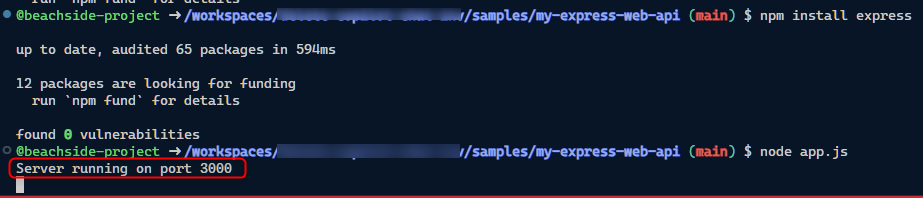

# 🧪 JavaScript: Express を使った Web API の作成

ここでは、GitHub Copilot Chat を活用して、Node.js の代表的なフレームワークである Express.js で Web API の作成にチャレンジします。

以下のハンズオン構成で、製品 (product) を管理する Web API を作成します。

- [Product の新規追加 API の作成](#product-の新規追加-API-の作成)
- [Product 一覧の取得 API の作成](#product-一覧の取得-API-の作成)
- [次のステップ](#次のステップ)

## Product の新規追加 API の作成

準備として、Codespaces で以下の操作をします。

- samples/my-express-web-api にある app.js を開きます。
- ターミナルで、`samples/my-express-web-api` へ移動します。


<br>

`CTRL` + `ALT` + `I` でサイドバーに GitHub Copilot Chat を表示し、以下を入力しましょう。

```txt
Express を使って product を管理する web api を作りたいです。以下の仕様を満たすコードを書いてください。

- 管理する product のスキーマは id, name, price
- 新規 product の追加を作ってほしい
- データストアは、json のローカルファイルを使用
```

GitHub Copilot Chat からの回答に沿って実装を進めてみましょう。

- 実装が終わったらターミナルで `node app.js` を実行して API が実行することを確認してみましょう。
- 実行時にエラーが出た場合は、エラーメッセージを GitHub Copilot Chat に入力して解決しましょう。

正常に実行できた場合、以下図のように「Server running on port 3000」と表示されます。



<br>

- VS Code のエクスプローラーで、app.js と同じディレクトリにある test.http を開く。
- "Send Request" をクリックしてリクエストを送信してみましょう。
  - Send Request がクリックできない場合は、test.http ファイルを開きなおすことで改善します。
  - リクエストのパスが異なる場合は、実装したコードに合わせてパスを変更し、リクエストを送信します。

> [!TIP]
> これは VS Code の拡張機能 Rest Client を使って API をコールする方法です。


<br>

正常にレスポンスを取得できた場合、product.json といったファイルにデータが保存されていることを確認します。  
なお、保存先のファイル名は生成されたコードによって異なる場合はありますので、実装されたコードに合わせて確認します。

同じリクエストをもう一度送信して、データが追加されることを確認しましょう。
また、エラーが出た場合は、エラーメッセージを GitHub Copilot Chat に入力して解決にチャレンジしましょう。

参考までに、ここまでのコードを記載します。

```js
const express = require('express');
const fs = require('fs');
const app = express();
app.use(express.json());

let products = [];

// Product schema
class Product {
    constructor(id, name, price) {
        this.id = id;
        this.name = name;
        this.price = price;
    }
}

// POST endpoint for adding a new product
app.post('/products', (req, res) => {
    const product = new Product(req.body.id, req.body.name, req.body.price);
    products.push(product);
    saveProductsToFile();
    res.status(201).send(product);
});

// Function to save products to a JSON file
function saveProductsToFile() {
    fs.writeFile('products.json', JSON.stringify(products), (err) => {
        if (err) throw err;
        console.log('Data written to file');
    });
}

const port = process.env.PORT || 3000;
app.listen(port, () => console.log(`Server running on port ${port}`));
```

## Product 一覧の取得 API の作成

次に、product 一覧を取得する API を作成します。デバッグを停止して、GitHub Copilot Chat に以下の文章を入力します。

```txt
product 一覧を取得するコードを追加して
```

生成されたコードを実装して、デバッグを実行します。

- エラーが出た場合は、エラーメッセージを GitHub Copilot Chat に入力して解決しましょう。
- 正常に起動したら、test.http を開き、`GET http://localhost:3000/products` の Send Request をクリックして、product 一覧が取得できることを確認します。
  - Send Request がクリックできない場合は、test.http ファイルを開きなおすことで改善します。

私の場合は、products.json にデータが入っているのに、product 一覧は0件でした。これは、起動時に products.json からデータを読み込む処理がないためです。

デバッグを停止して、GitHub Copilot Chat に以下の文章を入力します。

```txt
アプリの起動時に products.json を読み込むようにコードを修正して
```

生成されたコードを実装して、デバッグを実行します。ここまでくるとこの後の GitHub Copilot Chat との向き合い方も見についてきましたでしょうか。

- エラーが出た場合は、エラーメッセージを GitHub Copilot Chat に入力して解決しましょう。
- 正常に起動したら、test.http を開き、`GET http://localhost:3000/products` の Send Request をクリックして、product 一覧が取得できることを確認します。
- 改めて test.http でproduct の新規追加 API をコール後、product 一覧でデータが増えていることを確認します。

参考までにここまでのサンプルコードを記載します。

```js
const express = require('express');
const fs = require('fs');
const app = express();
app.use(express.json());

let products = [];

// Product schema
class Product {
    constructor(id, name, price) {
        this.id = id;
        this.name = name;
        this.price = price;
    }
}

// GET endpoint for retrieving all products
app.get('/products', (req, res) => {
    res.send(products);
});

// POST endpoint for adding a new product
app.post('/products', (req, res) => {
    const product = new Product(req.body.id, req.body.name, req.body.price);
    products.push(product);
    saveProductsToFile();
    res.status(201).send(product);
});

// Function to save products to a JSON file
function saveProductsToFile() {
    fs.writeFile('products.json', JSON.stringify(products), (err) => {
        if (err) throw err;
        console.log('Data written to file');
    });
}

function loadProductsFromFile() {
    fs.readFile('products.json', (err, data) => {
        if (err) throw err;
        products = JSON.parse(data);
    });
}

// Load products from file on startup
loadProductsFromFile();
const port = process.env.PORT || 3000;
app.listen(port, () => console.log(`Server running on port ${port}`));
```

## 次のステップ

後は時間の許す限り自由に Web API の機能を充実させていきましょう。機能追加のアイデアをいくつかあげます。

- product の新規作成時、`id` が重複している場合は HttpStatusCode 409 を返す実証を追加してみましょう。
- product の `name` でデータを取得する API を作成してみましょう。
- テストコードを書いてみましょう。

---

[📋 セルフペースドハンズオンの目次へ戻る](./README.md)
