# 🧪 GitHub Copilot 入門

> ※ このハンズオンは、[dzeyelid](https://github.com/dzeyelid)氏作成の[GitHub-Zen-Labs/github-copilot-playground short.md](https://github.com/GitHub-Zen-Labs/github-copilot-playground/blob/main/docs/comprehensive/self-paced-handson/short.md) と同一の内容になります。

ここでは、GitHub Copilot の入門編として、Code completion (コード補完) と Copilot Chat の使い方のコツを学びます。

1. [GitHub Copilot (code completion)](#1.-GitHub-Copilot(code-completion))
2. [GitHub Copilot Chat on Visual Studio Code](#2.-github-copilot-chat-on-visual-studio-code)


## 1. GitHub Copilot(code completion)

GitHub Copilot(code completion)は、カーソル位置に、AIによるコード補完の候補を提案してくれる機能です。

試しに、`sample/nodejs/main.js`を開き、コードを書き始めてみましょう。以下のコードを、コピー＆ペーストではなく、入力してみてください。

```js
// 四則演算を行う

const add
```

ちょうど書き終わるころ、下図のように`const add`の後ろに候補が表示されるのがわかりますか？


これがGitHub Copilotによる候補です。確定するには、「Tab」キーを入力してください。候補を無視するには、そのまま書き続けるか、`Esc`キーでクリアできます。

候補を生成して返却されるまでの間、エディタ右下のGitHub Copilotのアイコンが回転する表示になります。このアイコンの背景が暗い黄色の場合は、GitHub CopilotがDeactive（無効）になっているので、クリックしてActive（有効）に切替えてください。


候補はいくつか提示されることがあります。候補のグレーの文字列にカーソルを乗せると表示されるウィンドウを利用するか、キーバインドで切替えることができます。


| OS |  次の候補を表示 | 前の候補を表示 |
|----|----|----|
| Windows, Linux | `Alt` + `]` | `Alt` + `[` |
| macOS | `Option` + `]` | `Option` + `[` |

さて、AIによる候補を得るには、LLMにコンテキストを渡します。GitHub Copilot(code complition)では、以下の箇所がコンテキストとして渡されます。ただし、コンテキストを渡すためのトークンにはサイズの制限があるため、優先順位が高いものから順に渡されます。

- カーソルの**前後**のコードやコメント
- **編集中のファイル全体**
- タブで開いているファイル（**同じ拡張子が優先**される）

会話型のAIと異なる特徴として、前後の文脈を含められることが挙げられます。これは、FIM（Fill-in-the-Middle）という手法が採用されています。

より候補の精度を上げるには、コメントや関数や変数の命名が重要です。

コメントのコツは、3つのSです。要件や説明を長々書くよりも、簡潔に、具体的に、短く書くと候補に反映されやすいです。また、ファイルの先頭に、そのファイルで行う処理についてひとまとめに書いておくことも有効です。

- Single - 簡潔に
- Specific - 具体的に
- Short - 短く

### 演習

`sample/nodejs/main.js`でもう少し試してみましょう。

1. 候補をうまく利用しながら、四則演算を行う関数を完成させてください。

   ```js
   // 四則演算を行う

   const add = (a, b) => a + b;
   const sub = (a, b) => a - b;
   const mul = (a, b) => a * b;
   const div = (a, b) => a / b;
   ```

2. `mul`や`div`の関数名を省略しない形に書換え、`sub`も書きなおそうとしてみてください。（カーソルの後方もコンテキストに含められることを確認）

   ```js
   // 四則演算を行う
   
   const add = (a, b) => a + b;
   const sub = (a, b) => a - b;
   const multiply = (a, b) => a * b;
   const divide = (a, b) => a / b;
   ```

   `sub`に対して`subtract`の候補が提示されるでしょう。
   
3. 各行にコメントを記述してみましょう。書き進むにつれ、適切な候補が提案されるので、速く書けますね。
   

演習では割愛しますが、編集中のファイルとは別に、同じ拡張子のファイルをタブで開くと、その内容も加味して候補を提案してくれるようになります。ぜひ試してみてください。

## 2. GitHub Copilot Chat on Visual Studio Code

GitHub Copilot Chatは、チャットインタフェースを介してGitHub Copilot（LLM）と対話できる機能です。

このハンズオンでは、Visual Studio Codeでの利用をご紹介します。

GitHub Copilot Chatを利用するには、様々な方法があります。

- サイドバー（`Ctrl + Alt + i`）
- インライン（`Ctrl + i`）
- クイックチャット（`Ctrl + Shift + i`）

### サイドバー

左のGitHub Copilot Chatのアイコンを選択すると開く画面です。おそらく、GitHub Copilot Chatを使うときにメインで使う画面になるでしょう。

このUIから、開発に関する疑問を自然言語で質問できます。日本語でも大丈夫です。

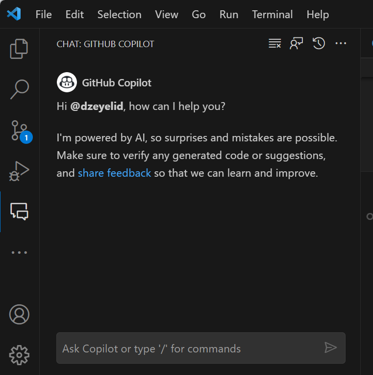

GitHub Copilot Chatは、エディタの状態によってコンテキストを取り込みます。例えば、ファイルを編集中であれば、そのファイルの表示されている行をコンテキストとして扱います。

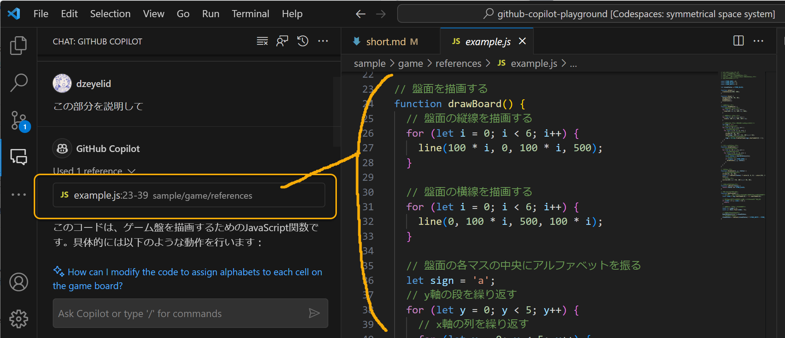

選択している場合は、その選択範囲がコンテキストとして扱われます。

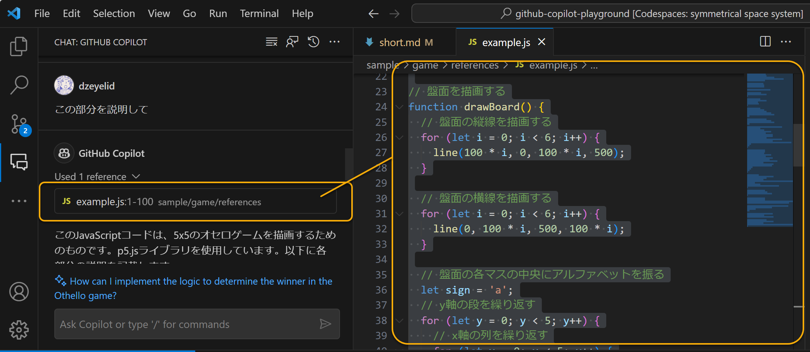

また、コマンド（後述）の`@workspace`を指示すると、開いているディレクトリを対象にコンテキストを取り込みます。（必ずしもすべての情報を網羅するわけではありません。）

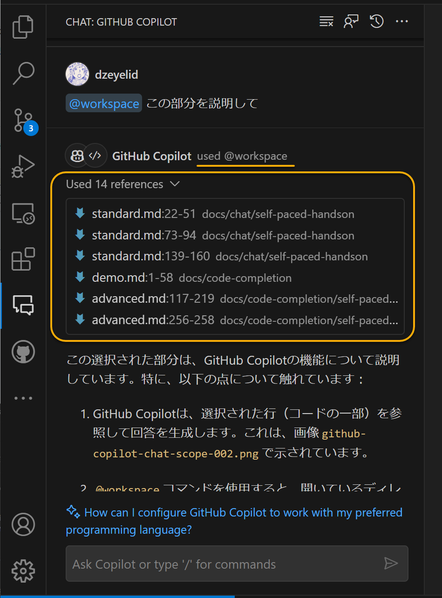

さて、回答の中で、コードやbashなどのコマンドを提示してくれることも多いです。コードブロックにカーソルを乗せるすると表示されるメニューから、エディタのカーソル位置に挿入したり、ターミナルで実行したりすることができます。

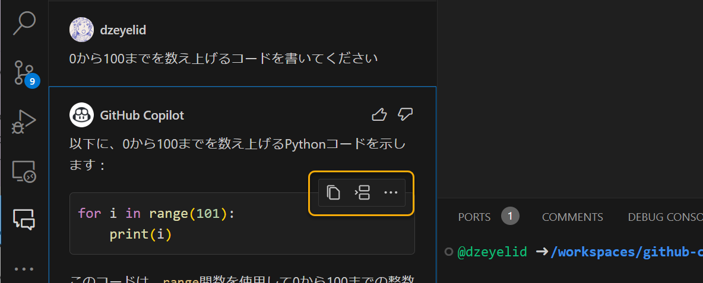

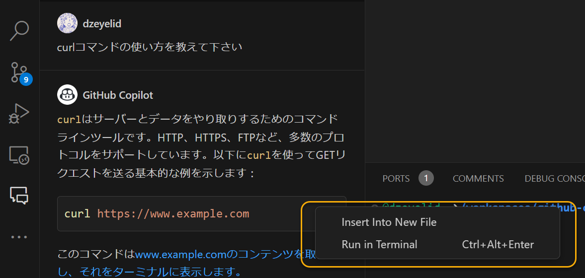

| メニュー項目 | 説明 |
|----|----|
| Copy | コードをクリップボードにコピーする |
| Insert at Cursor | エディタのカーソル位置にコードを挿入する |
| Insert Into New File | 新しいファイルとしてコードを挿入する |
| Run in Terminal | ターミナルにコードを貼りつける |

GitHub Copilot Chatは会話の文脈を考慮して回答してくれます。会話の履歴を消去するには、図に示す画面上部の「Clear」ボタンを選択します。

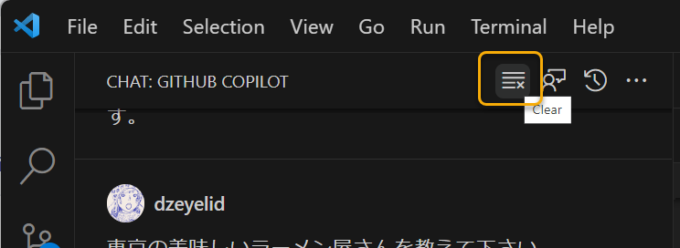

会話には、自然言語の指示だけでなく、コマンドも使えます。入力欄に`/`を打ち込むと、利用できるコマンドが表示されます。

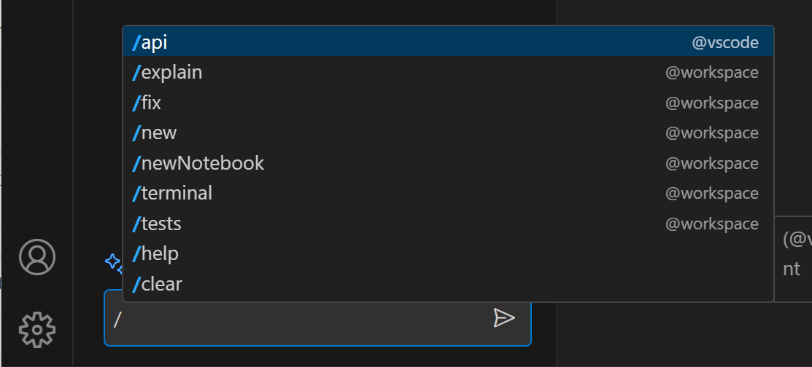

現時点（2023年11月）で利用できるコマンドは以下の通りです。

| コマンド | 説明 |
|----|----|
| `/api` | VS Code拡張機能の開発に関して質問する |
| `/explain` | 選択したコードがどう動作するかを説明する |
| `/fix` | 選択したコードに含まれる問題の解決方法を提案する |
| `/new` | 新しいワークスペース（※）の土台となるコードを生成する（Node.jsやPythonなどを指定する） |
| `/newNotebook` | 新しいJupyter Notebookを作成する |
| `/terminal` | ターミナルに関して質問する |
| `/tests` | 選択したコードに対するユニットテストを生成する |
| `/help` | GitHub Copilot Chatの使い方を確認する |
| `/clear` | 会話の履歴を削除する |

### インライン

サイドバーだけでなく、エディタのカーソルの位置もしくは選択している部分に対して、インラインでGitHub Copilot Chatに質問ができます。採用する場合は「Accept」またはEnterキー押下、無視する場合は「Discard」またはフォーカスを外しEscキー押下で操作します。

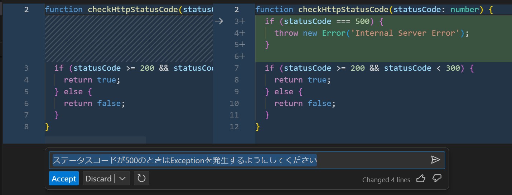

差分の表示がわかりやすいため、コードに直接変更を加えたい場合はインラインでの利用がおすすめです。

インラインでGitHub Copilot Chatに問い合わせるには、ショートカット（`Ctrl + i`）を使うか、右クリックのメニューから「Copilot」→「Start Code Chat」を選択します。

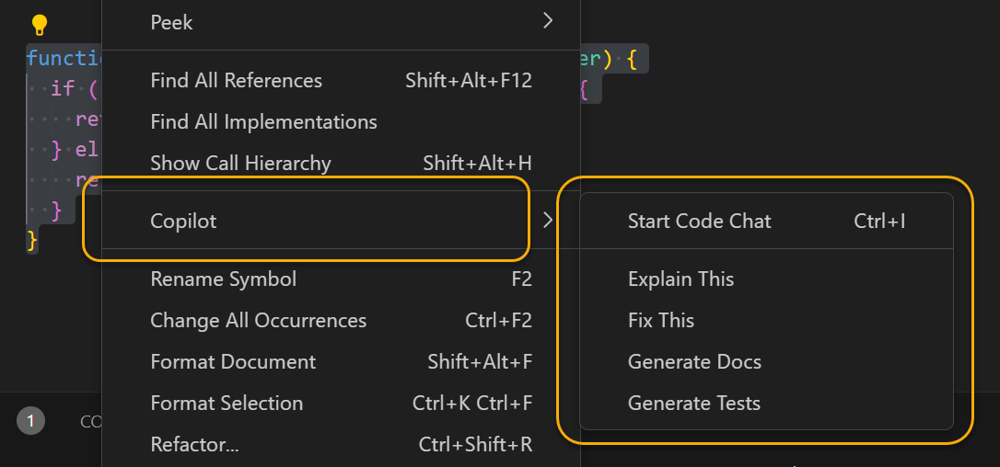

「Fix this」を選択した場合は、インラインで`/fix`コマンドが実行されます。選ぶ項目によっては、サイドバーで会話が続けられるものもあります。

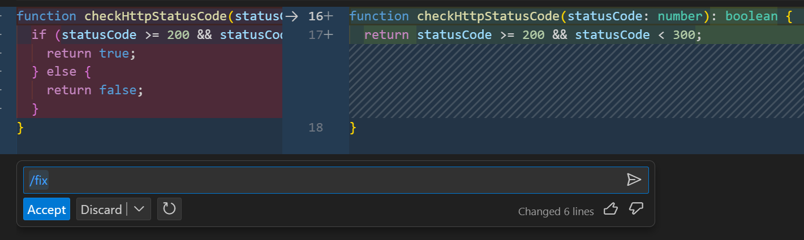

### クイックチャット

ショートカット（`Ctrl + Shift + i`）を使うと、コマンドパレットのようなUIでクイックチャットを利用できます。

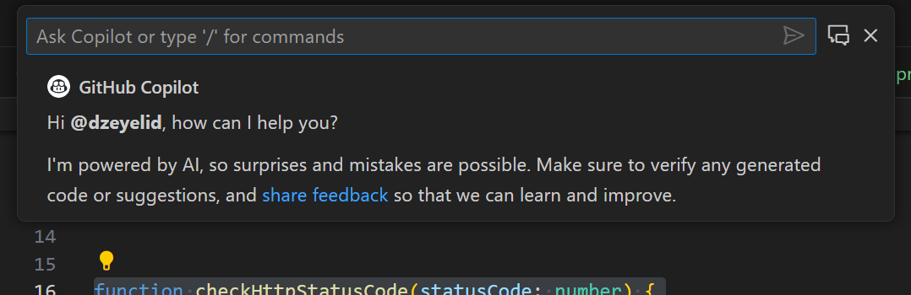

インラインと異なり、クイックチャットでは会話を続けられます。なお、サイドバーでの会話とは独立したセッションのようです。

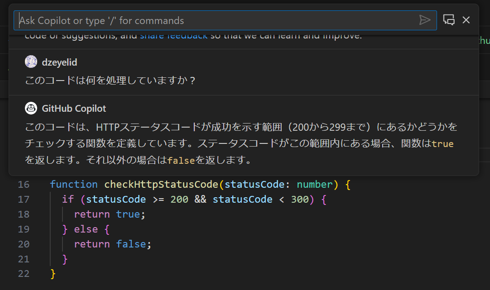

これらのようにさまざまな方法でGitHub Copilot Chatを利用できます。開発の作業に集中しながら、AIのサポートを受けより素早く作業を進められることでしょう。

### 演習

それでは、GitHub Copilot Chatで好きに遊んでみましょう！

冒頭で立ち上げたGitHub Codespacesの環境には主要な言語がインストールされています。

お題に悩む方は以下をご参考ください。

- コマンドラインで遊べるじゃんけんを作りたい
- コマンドラインで遊べるマスターマインドを作りたい
- HTMLとJavaScriptでリバーシゲームを作りたい

コマンドラインが実装簡単です。もの足りない方は、HTMLと組み合わせてGUIで作ってみるのも面白いです。

この環境には、HTMLをプレビューできる拡張機能をインストールしているので、HTMLファイルを開いてエディタ右上のプレビューアイコン（見開きのノートに虫眼鏡をかざしてるアイコン）を選択すると、VS Code内のブラウザでプレビューできます。

- 参考: [Live Preview - Visual Studio Marketplace](https://marketplace.visualstudio.com/items?itemName=ms-vscode.live-server)


## まとめ

ここでは  GitHub Copilot の Code completion と Chat の機能を学びました。

---

[📋 セルフペースドハンズオンの目次へ戻る](./README.md)
